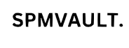
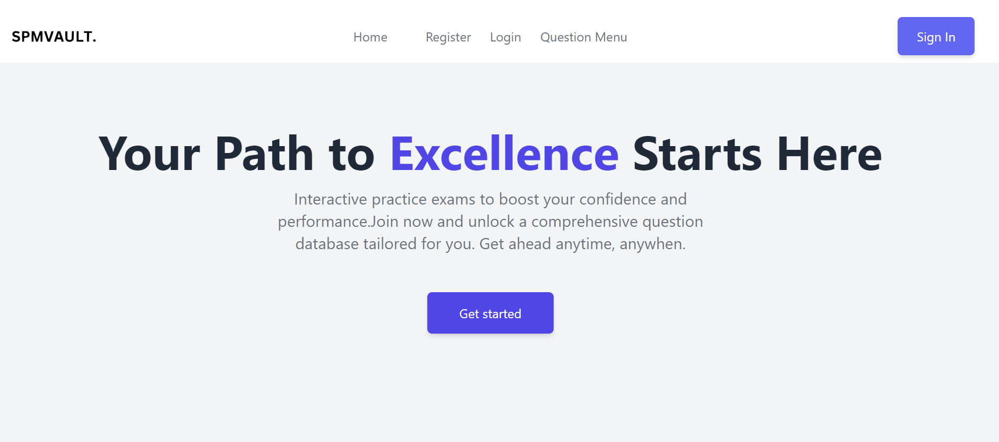

<!-- PROJECT LOGO -->
<br />
<div align="center">
  <a href="https://github.com/othneildrew/Best-README-Template">
    
  </a>

  <h3 align="center">SPMVault.com Front End</h3>

  <p align="center">
    Front end client for graduation project.
    <br />
    <a href="https://github.com/0xaiman/spmvault_web/tree/master"><strong>Explore the docs »</strong></a>
    <br />
    <br />
    <a href="https://spmvault-web.vercel.app/">View Demo</a>
  </p>
</div>


<!-- TABLE OF CONTENTS -->
<details>
  <summary>Table of Contents</summary>
  <ol>
    <li>
      <a href="#about-the-project">About The Project</a>
      <ul>
        <li><a href="#built-with">Built With</a></li>
      </ul>
    </li>
    <li>
      <a href="#getting-started">Getting Started</a>
      <ul>
        <li><a href="#prerequisites">Prerequisites</a></li>
        <li><a href="#installation">Installation</a></li>
      </ul>
    </li>
    <li><a href="#usage">Usage</a></li>
    <li><a href="#roadmap">Roadmap</a></li>
    <li><a href="#contributing">Contributing</a></li>
    <li><a href="#license">License</a></li>
    <li><a href="#contact">Contact</a></li>
    <li><a href="#acknowledgments">Acknowledgments</a></li>
  </ol>
</details>


<!-- ABOUT THE PROJECT -->
## About The Project

 <a href="https://spmvault-web.vercel.app/">
    
  </a>

With the concerning poor performance of SPM student recently, I have decided to create a website to facilitate SPM revision online. Currently, ost students still relies heavily on pen and papers. WHile these are good to simulate real exam, it tends to get bland and boring for most students. Not to mention individual students need to go out and buy their own excercise and past year books which lead to wasteful and additional expense. 

SPMvault.com aims to address this by providing one-stop database to host past year exam , and give immediate result to stduent. On top of that, we provide feedback in the form of data driven dashboards so student can understand their own performance and where to address their learning problems.

This project is part of Graduation project for [Kelasprogramming.com bootcamp](https://kelasprogramming.com/mern-bootcamp-02/), and this project is still in the works.


<p align="right">(<a href="#readme-top">back to top</a>)</p>


### Built With


* 
* 


<p align="right">(<a href="#readme-top">back to top</a>)</p>


<!-- GETTING STARTED -->
## Getting Started

Follow these instructions to set up your frontend project locally. To get a local copy up and running, follow these simple steps.

### Prerequisites

This is an example of how to list things you need to use the software and how to install them.
* npm
  ```sh
  npm install npm@latest -g
  ```

### Installation

_Below are the steps to install and set up your frontend app._

   ```sh
   git clone https://github.com/0xaiman/spmvault_web.git
   ```
3. Install NPM packages
   ```sh
   npm install
   ```

4. Start the development server
   ```sh
   npm run dev
   ```

<p align="right">(<a href="#readme-top">back to top</a>)</p>


<
